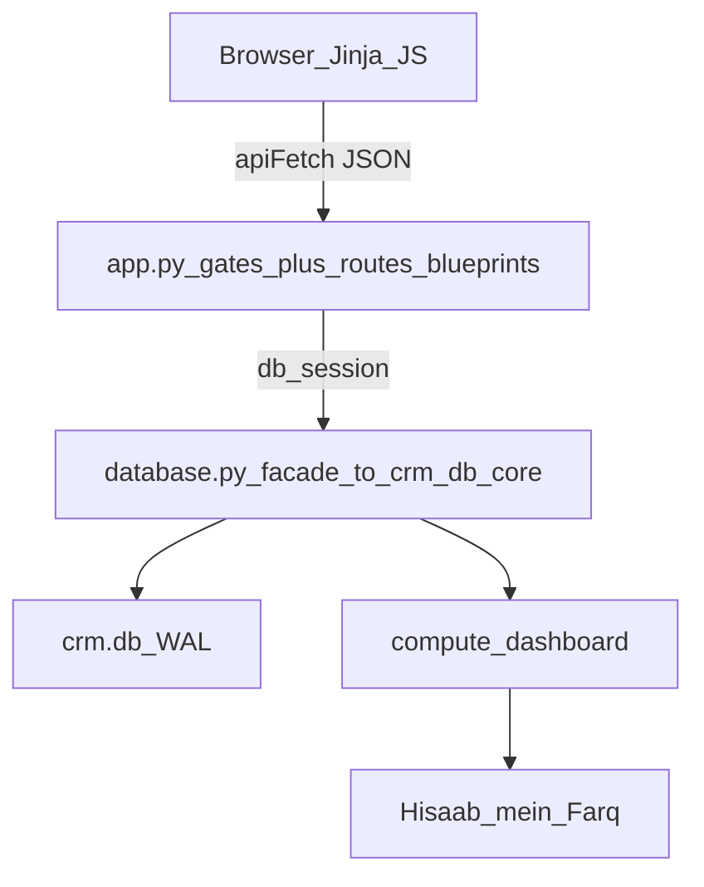

# Phone Reseller CRM — Full Audit Report

| Field | Value |
|-------|-------|
| **Product** | Phone Reseller CRM (MobileCRM) |
| **Branch** | `Test-1` |
| **Version** | `2.4.13` |
| **Audit date** | 2026-07-25 |
| **Remediation pass** | Architecture issues fixed (same date) — see §2; code cleanup/readability — see §15 |
| **Method** | Static audit + template→API map + stress/unit + focused money proofs |
| **Architecture reference source** | Phone Reseller CRM — Full Architecture Documentation (condensed in §14) |

---

## 1. Executive verdict (after remediation)

### Conditionally shipable for everyday partial udhar — Critical ledger bugs fixed

| Area | Before | After this pass |
|------|--------|-----------------|
| Partial purchase/sale khata (linked accounts) | **Broken** | **Fixed** (full bill + payment) |
| False Hisaab gap on partial udhar | **Yes** | **Cleared** (regression tested) |
| Unpaid supplier bill via Accounts | **Blocked** | **Allowed** |
| Billing / Close Month naming | Misleading | Clarified |
| Modal Escape (Devices / Reset CRM) | Broken | Fixed; dead JV entry removed |
| `partner1_*` settings writable | Dual truth | Writes rejected; partners table is SoT |
| Stress suite | 82/82 (blind to partial udhar) | **82/82** + finalize coverage **8/8** |

**Still open (deferred):** physical split of `crm_db/core.py` (~6.6k still one file; domain modules are navigation re-exports), dual migration systems, CSRF hard-block on non-loopback, merge `personal_assets`/`devices`, invoice edit/void APIs. Dead HTTP routes and blueprint/`crm_db` navigation layout are done (§15).

---

## 2. Fixed in this pass

| ID | Issue | Fix |
|----|-------|-----|
| C1 | Partial purchase + supplier → wrong khata (+20k vs −30k) | `_post_purchase_ledger`: credit **full `purchase_price`**, debit **paid_now** |
| C2 | Partial sale + buyer → wrong khata (−20k vs +40k) | `_post_sale_ledger`: debit **full `sale_price`**, credit **received_now** |
| H2 | Supplier unpaid bill rejected | `create_entry` + Accounts UI: credit without payment allowed |
| UX1 | Today “Record Sale” → Billing | Points to Inventory Mark Sold; Billing labeled paperwork |
| UX2 | Help “Sell phone + invoice → Billing” | Split into Mark Sold vs print invoice |
| UX3 | “Close the Month” oversells lock | Renamed **Reset Overview Monthly Counters** |
| M1 | `device-overlay` / `reset-crm-overlay` missing Escape | Added to `MODAL_REGISTRY`; removed dead `jv-acct-overlay` |
| M2 | `partner1_*` settings dual truth | Removed from `update_user_settings` whitelist |
| M3 | Stale dashboard comment (payable as debit) | Corrected to credit bill |
| T1 | Stress undo flake from leftover undo meta | `stress_test_crm.py` wipes undo meta + history on start |

**Correction to Architecture Documentation §5.2 / §5.3:** those sections described residual-only khata posting (credit/debit only the unpaid slice while also linking the cash payment to the same account). That pattern **inverted balances**. Canonical rule is now **full bill + payment**.

---

## 3. Still open

| Sev | Issue | Status |
|-----|-------|--------|
| High | `database.py` / `app.py` god modules | **Partially fixed** — thin facades + `crm_db/*` navigation modules + `routes/*` blueprints; implementation still concentrated in `crm_db/core.py` (~6.6k) |
| Medium | Dual migrations (legacy `_migrate_*` + empty `SCHEMA_MIGRATIONS`) | Open |
| Medium | Incomplete `USER_SCOPED_TABLES` constant (restore uses dynamic resolver — OK) | Open |
| Medium | `cash_in_hand` setting rebases opening mid-life if edited in Settings | Open |
| Medium | Soft negative cash/bank with `force=True` | Open |
| Medium | Dead APIs (`/api/dashboard`, billing phone GET, expense-categories, storage backups, vendor-reset-info, POST logout, unused cash-book/bank PUTs) | **Fixed** — HTTP handlers removed (§15); DB helpers kept where internal |
| Low | No CSRF; non-loopback bind only warns | Open (out of scope this pass) |
| Low | `personal_assets` ≈ `devices` duplication | Open (product decision) |
| Low | Invoice no edit/void | Open |
| Low | Client-only list filtering (scale) | Open |
| Low | Large `inventory.html` / `stress_test_crm.py` readability debt | Open (settings JS extracted; inventory extract deferred) |
| Ops | License HWID tests fail on Linux MAC fallback (Win/Mac primary IDs OK) | Open |

---

## 4. How the CRM works (summary)

Local Flask + SQLite desktop CRM for Panasonic/used-phone shops (Pakistan): inventory, khata, cash/bank, partners, Expected Liquid vs Actual Liquid (“Hisaab mein Farq”).



**Gates:** `ensure_db` → `require_license` → `require_auth` → undo baseline (still in `app.py`; handlers in `routes/*`).

**Money sync spine:** `ledger_links` + `_create_cash_book_synced` / `_create_account_entry_synced` / reverse-by-source.

**Sign convention:** `balance = SUM(debit) − SUM(credit)`; positive = they owe shop.

**Expected Liquid:**

```text
formula_expected =
  total_investment + total_net_profit - total_udhar
  - active_stock_worth + total_payables_combined - overhead_expenses_paid
liquidity_gap = expected_liquid - actual_liquid
```

---

## 5. Test results (post-fix)

| Suite | Result |
|-------|--------|
| `stress_test_crm.py` | **82 passed, 0 failed** |
| `test_finalize_coverage.py` | **8 passed, 0 failed** |
| Partial purchase supplier bal | −30,000 ✓ |
| Partial sale buyer bal | +40,000 ✓ |
| Gap after balanced partial purchase | ~0 ✓ |
| Supplier credit without payment | allowed ✓ |

---

## 6–13. Prior audit detail (historical findings)

The original findings-only audit (pre-fix) documented Critical residual-only khata bugs with proof numbers, UI mapping, security/tenancy, and page-by-page button status. Those Critical/High items listed in §2 are remediated. Deferred items remain in §3.

### Page routes (index)

| Route | Template |
|-------|----------|
| `/` | `today.html` |
| `/inventory` | `inventory.html` |
| `/accounts` | `accounts.html` |
| `/cashbook` | `cashbook.html` |
| `/overview` | `overview.html` |
| `/billing` | `billing.html` |
| `/purchase-invoice` | `purchase_invoice.html` |
| `/returns` | `returns.html` |
| `/settings` | `settings.html` |
| `/setup` | `setup.html` |
| `/monthly-closing` | `monthly_closing.html` |
| `/month-report` | `month_report.html` |
| `/personal-assets` | `personal_assets.html` |
| `/find-imei` | `find_imei.html` |
| `/customer-recovery` | `customer_recovery.html` |
| `/expense-summary` | `expense_summary.html` |
| `/day-book` | `day_book.html` |
| `/help` | `help.html` |
| `/login` | `login.html` |
| `/activate` | `activation.html` |

Approx. **~100** `/api/*` routes after dead-route removal; data layer still ~215 callables via `crm_db.core` / `database` facade.

### Prioritized remaining work

1. Physically move bodies out of `crm_db/core.py` into the domain modules (today they are re-export maps)  
2. Move new schema changes only into versioned `SCHEMA_MIGRATIONS`  
3. Hard-block or CSRF-protect non-loopback binds  
4. Invoice void if shops need it; unify personal assets / devices if product wants one tracker  
5. Extract large Inventory inline scripts → `static/inventory-page.js`  

---

## 14. Architecture Reference (from Architecture Documentation)

Condensed from *Phone Reseller CRM — Full Architecture Documentation*. Use this as the system mental model. **Money posting rule for phone sale/purchase with a linked account is full bill + payment** (see §2); older residual-only traces in the source Architecture Doc §5.2/§5.3 are obsolete.

### 14.1 Big picture

- **What:** Flask + SQLite local web server on the shop PC (`127.0.0.1:5050`), packaged as Windows `.exe` / Mac `.app` via PyInstaller. No cloud DB.
- **Who:** Used-phone reseller — buy/sell with IMEI, khata/udhar, borrow/consignment, partner capital, reconcile Expected vs Actual liquid.
- **Stack:** Python/Flask, raw sqlite3 (WAL), Jinja MPA + vanilla JS + local Tailwind, offline HMAC license.
- **Multi-tenancy:** `users` + `user_id` on business tables.

### 14.2 Schema (tables)

| Group | Tables |
|-------|--------|
| Identity | `settings` (legacy), `users`, `user_settings`, `password_reset_tokens` |
| Inventory | `phones`, `phone_expenses`, `phone_investments` |
| Khata | `accounts` (+ `is_expense_category`), `account_entries` |
| Cash/Bank | `cash_book_entries`, `bank_accounts`, `bank_transactions` |
| Partners | `partners`, `side_investments` (isolated reference) |
| Overhead / ref | `fixed_expenses`, `personal_assets`, `devices` (both isolated) |
| Paperwork | `invoices`, `purchase_invoices` (no ledger posts) |
| Sync / returns | `ledger_links`, `return_logs` |

**Connection:** `PRAGMA foreign_keys=ON`, `journal_mode=WAL`, `busy_timeout=30000`; one connection per request via `db_session()`.

**Migrations:** Legacy idempotent `_migrate_*` chain every `init_db()` + versioned `SCHEMA_MIGRATIONS` / `PRAGMA user_version` (scaffold; `CURRENT_SCHEMA_VERSION = 1`, empty list). Pre-migration `.backup()` safety net.

### 14.3 Backend (`app.py` + `routes/*`)

- Secret key per-install file; no CSRF (localhost threat model; warn on non-loopback).
- Gates in `app.py`: DB → license → auth → undo baseline.
- HTTP handlers in blueprints under `Source/routes/` (`auth`, `pages`, `inventory`, `billing`, `accounts_money`, `storage`, `reports`, `system`); helpers in `app_helpers.py`.
- JSON `/api/*` + thin page routes; `NegativeBalanceWarning` → 409 `requires_confirmation` + `force`.
- Nested routes re-check parent ownership (IDOR defense).

### 14.4 Frontend

- `apiFetch` (20s timeout, 401→login); toast + reload mutation pattern.
- `ui.js`: toasts, modals, charts, gap banner, updates, undo/redo.
- `settings-page.js`: Settings page wiring (`initSettingsPage`), loaded from `settings.html`.
- WhatsApp: client-only `wa.me` links (no server WhatsApp API).

### 14.5 Money model (canonical after fix)

**ledger_links** ties cash / account / bank rows to `(source_type, source_id)`.

**Purchase with supplier account:**

1. Cash/bank **out** for `paid_now = purchase_price − payable` (debit on supplier khata if linked).
2. Khata **credit** for **full `purchase_price`** (bill owed TO supplier).
3. Net supplier balance = `−payable`.

**Sale with buyer account:**

1. Cash/bank **in** for `received_now = sale_price − receivable` (credit on buyer khata if linked).
2. Khata **debit** for **full `sale_price`** (bill owed BY buyer).
3. Net buyer balance = `+receivable` (0 if fully paid).

**Opening stock:** no purchase ledger (money left long ago).  
**Returns:** do not unwind original cash; reverse outstanding debt; post new refund.  
**Side investments / personal assets / devices:** isolated from Expected Liquid.  
**Close / reset Overview counters:** sets `overview_period_start` only — does **not** lock books.

**Expected Liquid formula** (unchanged structure; now consistent with corrected khata):

```text
overhead_expenses_paid = fixed_expenses + expense-category account debits
formula_expected = investment + net_profit - udhar - active_stock_worth
                   + payables - overhead_expenses_paid
liquidity_gap = expected_liquid - actual_liquid
```

### 14.6 Cross-cutting

| System | Behavior |
|--------|----------|
| License | HWID (MachineGuid / IOPlatformUUID; MAC fallback); HMAC key; secret rotation list |
| Auth | pbkdf2 passwords; signed cookies; OTP + HWID password reset |
| Backup | Startup + hourly; SQLite `.backup()`; per-user logical restore |
| Undo | Whole-DB snapshots in side meta DB; per-user restore; cap 25 |
| Updates | Public GitHub manifest; SHA-256; detached swap + Data/ carry-forward |
| WhatsApp | `wa.me` only |

### 14.7 Packaging

PyInstaller onedir → Inno Setup (Win) / `.app` (Mac). Build refuses without `CRM_LICENSE_SECRET`; `verify_no_source()` blocks shipping `.py` / keygen.

---

## 15. Code cleanup & readability roadmap

Behavior-preserving pass after the money-model remediations. Ledger formulas unchanged. Vendor keygen, stress harness, and `_migrate_remove_journal_vouchers` kept. Phone type enum `JV` / `.type-jv` kept (live product type, not Journal).

### 15.1 What was deleted (Phase 1)

**Dead HTTP routes removed from the Flask surface** (no template/static callers):

| Method | Path |
|--------|------|
| GET | `/api/dashboard` (UI uses `/api/overview`) |
| GET | `/api/billing/phone/<id>` |
| GET | `/api/accounts/expense-categories` |
| GET | `/api/storage/backup-status`, `/api/storage/backups` |
| GET | `/api/auth/vendor-reset-info` |
| POST | `/api/auth/logout` (UI uses `GET /logout`) |
| PUT | `/api/cash-book/<id>`, `/api/banks/<id>/transactions/<tx_id>` |

Corresponding `database` update helpers were kept where other internal paths may still use them.

**Other strip:**

- Noop `seed_expense_accounts` + call sites in `register_user`
- Unused `CONDITION_OPTIONS`; JV undo label rows in `_UNDO_ACTION_LABELS`
- `.journal-table-wrap` CSS; stale “Journal” comment in `createSearchableAccountSelect`
- “journal vouchers” wording from README / customer-build feature lists
- Stale `SOURCE_NAMES` entries in build/performance scripts
- `Source/README.md` rewritten to point at root README
- Shortened Baroobaar/JV historical comments (migration kept)

### 15.2 Module map after split (Phase 2)

| Path | Role |
|------|------|
| `Source/database.py` | Thin alias of `crm_db.core` (`import database as db` unchanged, including underscore helpers and test patches) |
| `Source/crm_db/core.py` | Full data-layer implementation (~6.6k lines) |
| `Source/crm_db/conn.py` … `backup_undo.py` | Domain navigation re-exports (`ledger`, `phones`, `accounts`, `reports`, `schema`, `migrations`, …) |
| `Source/app.py` | Flask app, secret key, before_request gates, context processor, error handlers, blueprint registration |
| `Source/app_helpers.py` | Shared request helpers (`_current_user_id`, amount/status validators, logo/folder pickers, …) |
| `Source/routes/*.py` | Blueprints: `auth`, `pages`, `inventory`, `billing`, `accounts_money`, `storage`, `reports`, `system` |
| `Source/static/settings-page.js` | `initSettingsPage` + Settings-only helpers |
| `Source/static/ui.js` | Shared UI (toasts, modals, theme, updates, searchable selects, …) |

### 15.3 Before / after line counts

| File | Before (pre-cleanup) | After |
|------|----------------------|-------|
| `Source/database.py` | ~6,595 | ~19 (facade) + `crm_db/core.py` ~6,568 |
| `Source/app.py` | ~2,273 | ~388 (+ `routes/*` + `app_helpers.py`) |
| `Source/static/ui.js` | ~1,299 | ~904 (+ `settings-page.js` ~401) |

### 15.4 Must-keep list

- `stress_test_crm.py`, `test_finalize_coverage.py`, and related audit/stress artifacts
- License / vendor keygen stack
- `_migrate_remove_journal_vouchers` and other `_migrate_*` safety migrations
- Phone type `JV` / CSS `.type-jv`
- Money posting rules fixed in the architecture remediation pass (full bill + payment)

### 15.5 Remaining readability debt

- **Physical** move of function bodies from `crm_db/core.py` into domain modules (re-export map is navigation-only today)
- Dual migration systems (legacy chain + versioned scaffold)
- Large `templates/inventory.html` inline scripts (extract deferred)
- Large `stress_test_crm.py` harness size
- Incomplete `USER_SCOPED_TABLES` documentation vs dynamic restore resolver

### 15.6 Gate

| Suite | Result after cleanup |
|-------|----------------------|
| `test_finalize_coverage.py` | **8/8** |
| `stress_test_crm.py` | **82/82** |

---

*Report updated after architecture remediation and code-cleanup/readability pass on Test-1. Critical money posting matches shopkeeper intuition; Architecture Doc residual-only §5.2/§5.3 traces are obsolete. Dead API surface removed; largest modules navigable via `crm_db/*` and `routes/*` (§15).*
