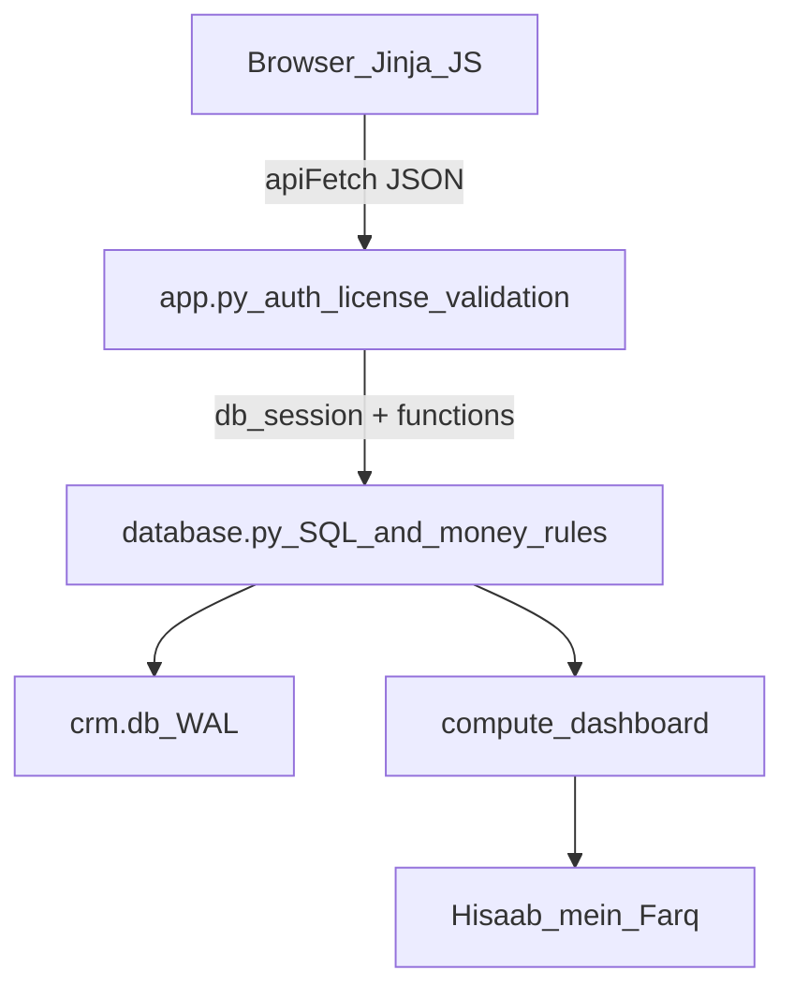

# Phone Reseller CRM — Full Audit Report

| Field | Value |
|-------|-------|
| **Product** | Phone Reseller CRM (MobileCRM) |
| **Branch** | `Test-1` |
| **Commit** | `17b1a9d` |
| **Version** | `2.4.13` |
| **Audit date** | 2026-07-25 |
| **Method** | Static code audit + template→API mapping + automated stress/unit suites + focused money-proof script |
| **Scope** | Findings only (no product code changes in this pass) |
| **Live browser click-through** | Not primary — UI completeness from static mapping; items not proven by code/tests marked `Unverified-live` |

---

## 1. Executive verdict

### Do Not Ship as a trustworthy money product for everyday partial udhar

**Automated stress suite: 82/82 PASS.** That proves many sync paths are consistent under load. It does **not** prove khata balances are correct for the most common shop flow: **partial cash + linked supplier/buyer account**.

| Area | Verdict |
|------|---------|
| Core architecture (Flask ↔ SQLite layering) | Sound |
| Cash book movement on purchase/sale | Correct in tested cases |
| Partial udhar khata (linked accounts) | **Broken — Critical** |
| Expected Liquid / Hisaab mein Farq after partial udhar | **Lies when khata is wrong** |
| Invoices | Paperwork only (easy to misunderstand) |
| UI wiring (most CRUD buttons) | Mostly OK; modal Escape gaps; some dead APIs |
| License tests on Linux CI host | 2 failures (HWID falls back to MAC) |

**Ship only after fixing Critical #1–#2** (and preferably High #3–#4). Until then, shopkeepers who buy/sell partly on credit with a khata account will see inverted party balances and a false gap.

---

## 2. How the CRM works

### Framework & stack

| Layer | Technology |
|-------|------------|
| Runtime | Local desktop web app — Flask `app.run(threaded=True)` on `127.0.0.1:5050` |
| Backend | Python 3, Flask routes in `Source/app.py` (~2,273 lines) |
| Data | Raw `sqlite3`, no ORM — `Source/database.py` (~6,576 lines, **215 functions**) |
| Frontend | Jinja2 MPA, vanilla JS, local Tailwind + `app.css` |
| Packaging | PyInstaller → Windows `.exe` / Mac `.app` |
| License | Offline HMAC hardware-ID activation (`license_guard.py`) |



**Layer rule (good):** `app.py` never writes SQL; `database.py` never touches Flask `session`/`request`.

**Request gates (order):** `ensure_db` → `require_license` → `require_auth` → undo baseline snapshot.

### Money model (intended)

One real-world event (buy/sell phone, expense, wasool) can touch:

1. `phones` (status / sale fields)
2. `cash_book_entries` / `bank_transactions` (cash moved)
3. `account_entries` (khata / udhar)

`ledger_links` ties those rows under `(source_type, source_id)` so edit/delete can reverse everything.

**Sign convention (current):**

- `credit` = shop received money, **or** new debt owed **TO** a supplier
- `debit` = shop gave money, **or** new debt owed **BY** a customer
- `balance = SUM(debit) − SUM(credit)` → **positive = they owe the shop**; **negative = shop owes them**

**Expected Liquid (dashboard):**

```text
formula_expected =
  total_investment
  + total_net_profit
  - total_udhar
  - active_stock_worth
  + total_payables_combined
  - overhead_expenses_paid

liquidity_gap = expected_liquid - actual_liquid
actual_liquid = cash_in_hand + bank_balances
```

---

## 3. Architecture findings

| Sev | Finding | Evidence |
|-----|---------|----------|
| High | **God module** — all schema, migrations, money, reports, backup/restore in one file | `database.py` ~6.6k lines / 215 functions |
| Medium | **Dual migration systems** — legacy `_migrate_*` runs every start; versioned `SCHEMA_MIGRATIONS` is empty (`CURRENT_SCHEMA_VERSION = 1`) | `database.py` ~217–275, ~423+ |
| Medium | **Fat frontend utility** | `static/ui.js` ~1.3k — toasts, settings, updates, undo, gap banner, modals |
| Low | Flask threaded `app.run` as “production” | Acceptable for single-user localhost; not a WSGI server |
| Low | Snapshot undo of entire DB per mutation | Powerful but storage-heavy; couples to restore machinery |

**What is done well:** WAL + busy_timeout, per-request `db_session`, `BEGIN IMMEDIATE` on money races, SQLite `.backup()` (not file copy), dynamic ownership resolver for restore, stress suite for sync cascades.

---

## 4. Database findings

### Core tables

| Group | Tables |
|-------|--------|
| Identity | `users`, `user_settings`, legacy `settings`, `password_reset_tokens` |
| Inventory | `phones`, `phone_expenses`, `phone_investments` |
| Khata | `accounts`, `account_entries` |
| Cash/Bank | `cash_book_entries`, `bank_accounts`, `bank_transactions` |
| Partners | `partners`, `side_investments` |
| Overhead / ref | `fixed_expenses`, `personal_assets`, `devices` |
| Paperwork | `invoices`, `purchase_invoices` |
| Returns / sync | `return_logs`, `ledger_links` |

### Schema / tenancy issues

| Sev | Finding | Evidence |
|-----|---------|----------|
| Medium | `USER_SCOPED_TABLES` incomplete (`phones, accounts, partners, fixed_expenses, bank_accounts, cash_book_entries` only) | Used for first-user backfill; restore wisely uses `_resolve_table_ownership_paths` |
| Medium | `phones` is a **god row** — purchase + sale + payment methods + account/bank ids + acquisition type on one unit | Lifecycle as columns/status, not events |
| Low | `personal_assets` ≈ `devices` — duplicate isolated reference models | Parallel CRUD; both excluded from Expected Liquid |
| Low | Invoice `phone_id` without FK (documented intentional) | Orphans possible if phone deleted before invoice block was added |

---

## 5. Money / finance / sync findings

### Critical — proven with numbers (temp DB, commit `17b1a9d`)

#### C1. Partial purchase + supplier account → wrong khata

| | Value |
|--|------:|
| Scenario | Buy 80,000; pay 50,000 cash now; payable 30,000; supplier linked |
| Entries posted | `debit 50,000` (payment) + `credit 30,000` (udhar only) |
| **Actual supplier balance** | **+20,000** (reads as “supplier owes shop”) |
| **Expected** | **−30,000** (shop owes supplier) |
| Cash movement | 500,000 → 450,000 ✓ |
| Dashboard after | `liquidity_gap = −50,000` (false gap) |

**Root cause:** `database.py` → `_post_purchase_ledger` posts residual payable as credit **and** links paid_now as supplier debit, instead of **full bill credit + payment debit** (or unpaid-only credit with cash unlinked from khata).

#### C2. Partial sale + buyer account → wrong khata

| | Value |
|--|------:|
| Scenario | Sell 100,000; receive 60,000; receivable 40,000; buyer linked |
| Entries posted | `credit 60,000` + `debit 40,000` |
| **Actual buyer balance** | **−20,000** (reads as “shop owes buyer”) |
| **Expected** | **+40,000** (buyer owes shop) |

**Root cause:** `database.py` → `_post_sale_ledger` — same residual-only split inverted.

#### Control (works)

100% pay-later purchase (payable = full price, no cash): supplier balance **−40,000** ✓ — stress suite covers this path, **not** partial+linked.

### High

| ID | Finding | Evidence |
|----|---------|----------|
| H1 | Dashboard inherits bad khata → false Hisaab mein Farq | `compute_dashboard` → `accounts_summary`; proof gap −50,000 after C1 |
| H2 | Accounts cannot post unpaid supplier bill | `create_entry`: `needs_payment = credit OR (debit AND expense)` → credit always requires Cash/Bank. Proof: `REJECTED: Select payment method — Cash or Bank` |
| H3 | Stress suite blind spot | 82 tests pass while C1/C2 fail — no assert on partial+linked balances |

### Medium

| ID | Finding | Evidence |
|----|---------|----------|
| M1 | Dual money sources: `cash_in_hand` **setting** = opening base; live balance = opening + cash-book | Changing Settings “Cash in Hand (Opening)” mid-life rebases history without a cash-book row |
| M2 | `partner1_*` / `partner2_*` settings still whitelisted alongside `partners` table | Seed-once + dashboard fallback; stale capital possible |
| M3 | Invoices never post ledger | `create_invoice` / `create_purchase_invoice` — paperwork only |
| M4 | Soft negative cash/bank with `force=True` | Pragmatic; stress run left cash/bank deeply negative |
| M5 | Stale comment: dashboard says payables posted as debit; code posts credit | Confuses future fixes |

### Low

| ID | Finding |
|----|---------|
| L1 | Side investments correctly isolated now; legacy shared `source_id=partner_id` still has ambiguous reverse refusal |
| L2 | Opening stock correctly skips purchase ledger |
| L3 | Close the Month only sets `overview_period_start` — does not lock books |

---

## 6. Common-sense & UX findings

| Sev | Issue | Why it hurts |
|-----|-------|--------------|
| High | Today “Record Sale” → `/billing` | Billing does **not** mark stock sold; real sale is Inventory |
| High | Help cheat sheet implies sell+invoice via Billing | Same confusion |
| Medium | “Close the Month” name | Sounds like accounting lock; only resets Overview monthly metrics tile |
| Medium | “Add Expense” on Cash Book vs “+ Expense” on phone | Same words, different ledgers (overhead vs per-phone) |
| Medium | Inventory modal title “Add New Device” vs Overview Devices | Two different “device” concepts |
| Medium | Purchase Invoice subtitle says paperwork; Billing header looks like a sale flow | Asymmetric clarity |
| Low | Month Report not in sidebar (Today link only) | Easy to miss vs Monthly Closing |
| Low | Help text about Food/Entertainment on Cash Book | Expense categories live on Accounts |

---

## 7. Broken / incomplete buttons & APIs

### Modal Escape registry (`static/ui.js` `MODAL_REGISTRY`)

| Overlay | In HTML? | In registry? | Status |
|---------|----------|--------------|--------|
| `jv-acct-overlay` | No | Yes | **Dead leftover** (Baroobaar/JV removed) |
| `device-overlay` | Yes (Overview) | No | **Escape won’t close** |
| `reset-crm-overlay` | Yes (Settings) | No | **Escape won’t close** |

### Dead / unused APIs (routed, no UI caller found)

| Route | Note |
|-------|------|
| `GET /api/billing/phone/<id>` | Billing uses IMEI datalist instead |
| `GET /api/accounts/expense-categories` | Unused |
| `GET /api/dashboard` | Superseded by `/api/overview` |
| `GET /api/storage/backups` | Unused from templates |
| `PUT /api/cash-book/<id>` | API exists; UI has Delete only |
| `PUT /api/banks/<id>/transactions/<tid>` | API exists; UI has Delete only |

### Page-by-page control map (summary)

#### Inventory — mostly OK

Load/CRUD phones, bulk sold/delete, expenses, repaired → Bought, partner invest fields, new account from form — all wired. Scan IMEI client-only.

#### Accounts — mostly OK; one incomplete

Account + bank CRUD, entries, statement, WhatsApp/print/export OK. **No Edit bank transaction button** (PUT API unused). Expense-categories GET unused.

#### Cash Book — incomplete edit

Add/delete entries + Add Expense (fixed) OK. **No Edit entry UI** despite `PUT /api/cash-book/<id>`.

#### Billing / Purchase Invoice — OK as paperwork; misleading as “sale”

Save/Print/WhatsApp/history OK. **No edit/void/delete invoice API.** Does not change stock or money.

#### Returns — OK

Purchase/sale return inventories + process + log wired; refund caps covered by stress tests.

#### Overview — OK APIs; Escape gap on Devices

Partners, reinvest, side investments, devices CRUD, gap banner, export backup OK. Device modal Escape incomplete.

#### Settings — OK APIs; Escape gap on Reset CRM

Shop, logo, auth, email, backup/restore, update, shutdown, reset OK.

#### Setup wizard — OK

Opening stock, cash, banks, khata, partners, complete — wired; opening stock correctly non-posting.

#### Monthly Closing — OK API, misleading name

`POST /api/monthly-closing/close-month` works; does not lock history.

#### Today / reports / personal assets / find IMEI / day book / expense summary / customer recovery / login / activation

APIs present and called as expected. Today quick action “Record Sale” → Billing is **Misleading** (see §6).

#### Base chrome

Undo/Redo, theme, update banner, setup reminder — wired.

---

## 8. Feature / function inventory (capability areas)

| Area | Primary home | Notes |
|------|--------------|-------|
| Auth / users / OTP / HWID reset | `database.py` + `app.py` + `email_service.py` | OTP rate-limit in-memory |
| License | `license_guard.py` | Client-side HMAC; fallback secret in binary |
| Phones lifecycle | `create_phone` / `update_phone` / bulk / returns | Ledger post on buy/sell |
| Khata | `create_entry`, statements, recovery | Supplier unpaid bill blocked (H2) |
| Cash / bank | cash book + bank txs + soft negative | Edit UI missing |
| Partners / side invest / reinvest | partners APIs | Side invest isolated |
| Dashboard / Today / Month | `compute_dashboard`, summaries | Gap formula sensitive to khata bugs |
| Invoices | create/list only | No void |
| Backup / restore / reset | `.backup()` + per-user restore | Multi-tenant safe (tested) |
| Undo / redo | Full DB snapshots | Cap 25 / user |
| Updates | `update_service.py` | Public manifest + checksum |
| Packaging | build_*.py, PyInstaller specs | Bake license secret in CI |

---

## 9. Security & tenancy

| Sev | Finding | Notes |
|-----|---------|-------|
| High (if LAN) | No CSRF; warning only when `CRM_HOST` non-loopback | Fine on 127.0.0.1; bind `0.0.0.0` changes threat model |
| Medium | License fallback secret extractable from binary | Build refuses without env — good; fallback still exists |
| Medium | Password min length 6; SMTP app password in settings | Weak by modern standards |
| Medium | OTP rate limit in-memory | Resets on process restart |
| Low | License intentionally client-side / casually bypassable | Documented in `license_guard.py` |
| Fixed historically | Shared Flask secret; restore wiping other tenants; OTP via wrong SMTP | See CHANGELOG v2.4.12 |

**Linux audit host note:** `test_license_guard` HWID-stability tests **FAILED** here because `_raw_machine_id()` falls back to `uuid.getnode()` (MAC) when Windows MachineGuid / macOS IOPlatformUUID are unavailable. On real Win/Mac customer machines the primary IDs apply; on Linux CI the MAC-fallback tests are environment-sensitive.

---

## 10. Test results (this audit run)

### `stress_test_crm.py`

| Metric | Value |
|--------|-------|
| Passed | **82** |
| Failed | **0** |
| Report | `artifacts/CRM_STRESS_TEST_REPORT.md` |

Stress load left extreme negative cash/bank (soft `force` paths) — expected under that harness, not a shop-happy path.

### `pytest` (`test_crm.py` + `test_license_guard.py`)

| Result | Count |
|--------|------:|
| Passed | 5 |
| Failed | 2 |

| Test | Result |
|------|--------|
| `test_all_logic_checks_pass` | PASS |
| `test_no_orphan_ledger_links` | PASS |
| `test_hardware_id_is_stable_even_if_mac_address_changes` | **FAIL** (Linux MAC fallback) |
| `test_activation_key_survives_hardware_id_recompute` | **FAIL** (same) |
| Password-reset code tests (3) | PASS |

### Focused money proof (not in stress suite)

| Case | Expected | Actual | Pass? |
|------|----------|--------|-------|
| Partial purchase supplier bal | −30,000 | +20,000 | **FAIL** |
| Gap after that purchase | ~0 | −50,000 | **FAIL** |
| Partial sale buyer bal | +40,000 | −20,000 | **FAIL** |
| Supplier bill credit w/o payment | allowed | rejected | **FAIL** |

---

## 11. Prioritized fix list for finalize

1. **Critical — Fix `_post_purchase_ledger` / `_post_sale_ledger`** to full-bill + payment (or unpaid-only khata with cash unlinked). Target: supplier bal = `−payable`, buyer bal = `+receivable`, full-cash+account → 0.
2. **Critical — Add regression tests** for partial purchase/sale with linked accounts + assert `liquidity_gap ≈ 0` on balanced books.
3. **High — Allow unpaid supplier bills** in `create_entry` (credit without payment for non-expense accounts); update Accounts UI copy.
4. **High — Fix Today/Help “sell” paths** to point at Inventory Mark Sold; label Billing as paperwork-only (match Purchase Invoice).
5. **Medium — Modal registry:** add `device-overlay`, `reset-crm-overlay`; remove dead `jv-acct-overlay`.
6. **Medium — Collapse dual truths:** stop writing `partner1_*` capital via settings; treat `cash_in_hand` setting strictly as opening (UI already says Opening).
7. **Medium — Rename Close the Month** to “Reset Overview monthly counters” (or equivalent).
8. **Medium — Expose or remove** unused PUT edit APIs for cash-book / bank txs; remove or wire dead GETs.
9. **Low — Migrate new schema work** into versioned `SCHEMA_MIGRATIONS`; stop growing legacy chain.
10. **Low — Split `database.py`** into schema/migrations/ledger/reports modules after money tests are green.
11. **Ops — Linux CI:** pin HWID test to stable machine-id source or skip MAC-fallback cases on Linux.

---

## 12. What is *not* a blunder

- Local SQLite + desktop packaging for single-shop owners  
- Opening stock skipping purchase ledger  
- Isolating personal assets / devices / (current) side investments from Expected Liquid  
- Invoices as print-only **if** UX clearly says so everywhere  
- Soft negative with confirm — acceptable for out-of-order shop entry if users understand it  

---

## 13. Appendix — Page route index

| Route | Template |
|-------|----------|
| `/` | `today.html` |
| `/inventory` | `inventory.html` |
| `/accounts` | `accounts.html` |
| `/cashbook` | `cashbook.html` |
| `/overview` | `overview.html` |
| `/billing` | `billing.html` |
| `/purchase-invoice` | `purchase_invoice.html` |
| `/returns` | `returns.html` |
| `/settings` | `settings.html` |
| `/setup` | `setup.html` |
| `/monthly-closing` | `monthly_closing.html` |
| `/month-report` | `month_report.html` |
| `/personal-assets` | `personal_assets.html` |
| `/find-imei` | `find_imei.html` |
| `/customer-recovery` | `customer_recovery.html` |
| `/expense-summary` | `expense_summary.html` |
| `/day-book` | `day_book.html` |
| `/help` | `help.html` |
| `/login` | `login.html` |
| `/activate` | `activation.html` |
| `/logout` | redirect |

Approx. **111** `/api/*` routes in `app.py`; **~122** `apiFetch`/`fetch` call sites in templates/static.

---

*End of audit report. Generated for branch Test-1 @ 17b1a9d. Findings-only; no Source/ remediations applied in this pass.*
